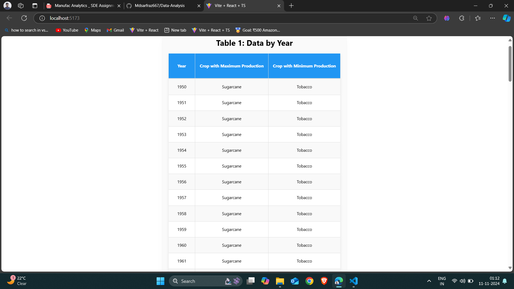
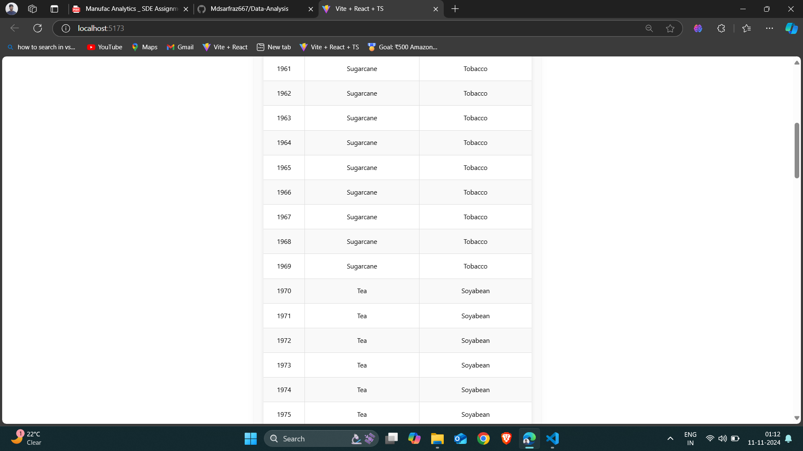
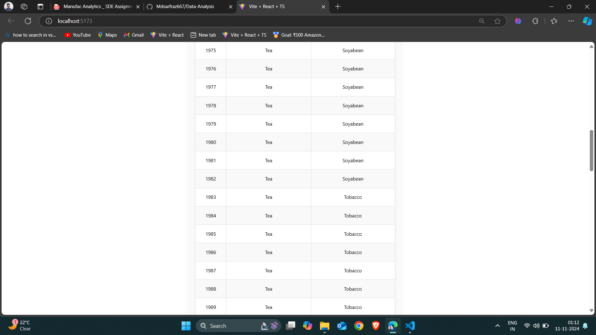
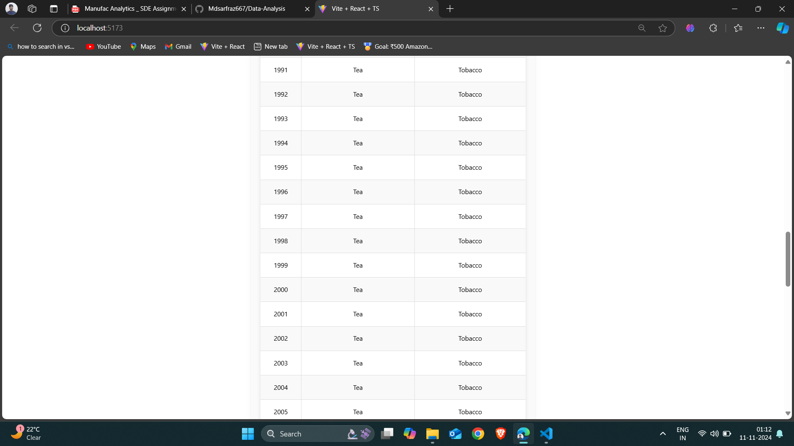
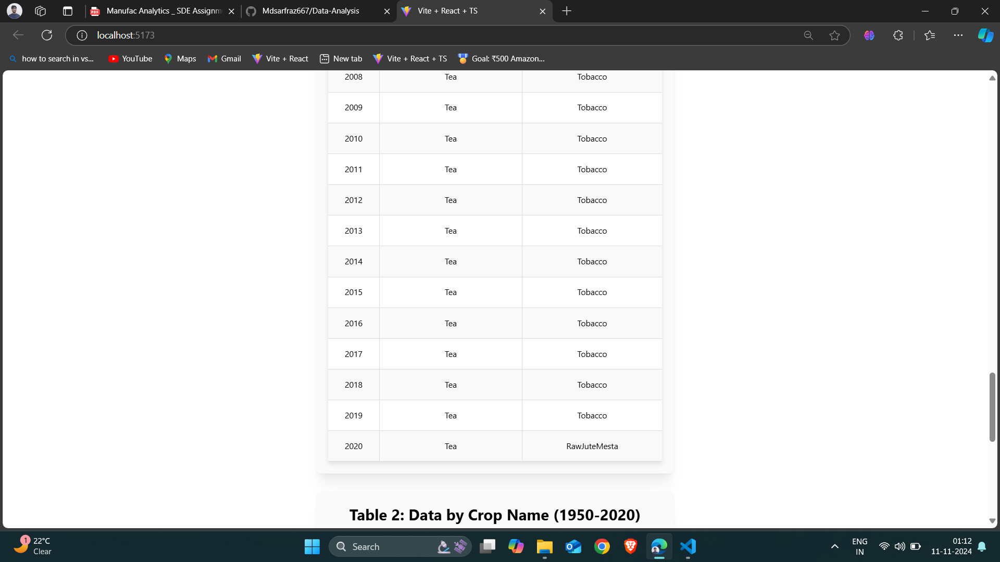

# Frontend Data Analysis

This project is a data analysis tool built with React and Vite. It aggregates and visualizes crop production data, displaying it in two interactive tables. The first table shows the data aggregated by year, and the second table shows the data aggregated by crop name over a period from 1950 to 2020.

## Features

- Aggregates crop production data by year.
- Displays the crop with maximum and minimum production for each year.
- Aggregates crop yield and cultivation area by crop name.
- Interactive tables with hover effects.
- Responsive and user-friendly UI using Mantine UI components.

## Technologies Used

- React
- Vite
- TypeScript
- Mantine (for UI components)

## Project Setup

### Prerequisites

Before getting started, make sure you have the following installed:

- [Node.js](https://nodejs.org/en/) (v16 or higher)
- [npm](https://www.npmjs.com/get-npm) (Node package manager)

### Installation

1. Clone this repository:

   ```bash
   git clone https://github.com/Mdsarfraz667/Data-Analysis
   ```

2. Navigate into the project directory:

   ```bash
   cd frontend-data-analysis
   ```

3. Install the required dependencies:
   ```bash
   npm install
   ```

### Running the Development Server

To start the development server, run:

```bash
npm run dev
```

This will start the Vite development server and open the project at [http://localhost:5173](http://localhost:5173).

### Build for Production

To build the project for production, run:

```bash
npm run build
```

This will bundle your project and output the static files into the `dist` directory.

## Screenshots

### Table 1: Data by Year

This table displays crop production data aggregated by year, showing the crop with maximum and minimum production for each year.

### Part 1 of Table 1:



### Part 2 of Table 1:



### Part 3 of Table 1:



### Part 4 of Table 1:



### Part 5 of Table 1:



### Table 2: Data by Crop Name (1950-2020)

This table shows the average yield and cultivation area for each crop from 1950 to 2020.


## License

This project is licensed under the MIT License - see the [LICENSE](LICENSE) file for details.

---
